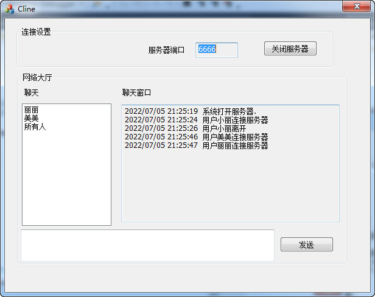
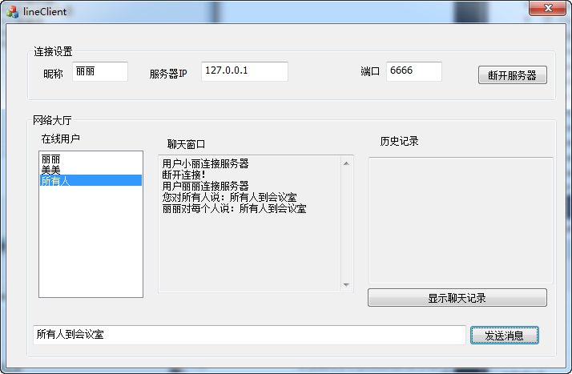
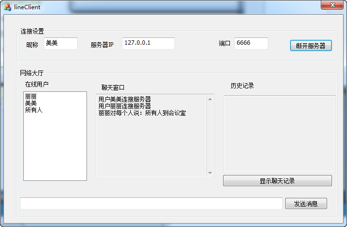

#### 复习下MFC SOCKET的操作

看到这个文章的 [基于MFC平台实现SOCKET通信](https://blog.csdn.net/qq_42034052/article/details/82628045)
,觉得不错。

但是代码不完整，于是发现时间实现全部代码。


##### 实现功能

[Cline](Cline) 为服务器代码，负责接收客户端。

[lineClient](lineClient) 为客户端代码，负责连接服务器。

1、上线通知

2、客户端下线通知

3、sokcet通信


##### 效果图









##### 协议


```

上线协议：MUSERNAME+用户名

给所有人发消息：MEVERY+msg

给某人发消息：M+用户名+msg

更新在线用户：MUPDATEUSERLIST+用户名1|用户名2|用户名3

客户主动离线协议：MOFFLINE+用户名

服务器关闭协议: MOFFSERVER

```


##### [Cline](Cline) 为服务器代码，负责接收客户端。


```
	/*
	* 启动服务器
	*/
	void StartServer();
	/*
	* 通知所有用户，关闭服务器
	*/
	void StopServer();
	/*
	* 更新界面消息
	*/
	void UpdateMsgText(CString str);
	/*
	* 接收客户端的消息
	*/
	void RecvData(CReceivingSocket* pSocket);
	/*
	* 处理消息
	*/
	void translateMsg(CString str, CReceivingSocket* pSocket);
	/*
	* 给客户端发送消息
	*/
	void SendMSGToEvery(CString &str);
	void SendMSGToOne(CString &str, CString &userSendName);
```


##### [lineClient](lineClient) 为客户端代码，负责连接服务器。

```
	/*
	* 向服务器发送消息
	*/
	void SendMsg();
	/*
	*  更新在线用户列表
	*/
	void UpdateUsers(CString &str, int index);
	/*
	* 更新界面消息
	*/
	void UpdateMsgText(CString &str);
	/*
	* 接收服务区消息
	*/
	void ReceiveMsg(CString &str, CClientSocket* pSocket);
	/*
	* 主动要求离线
	*/
	void Offline();
```
